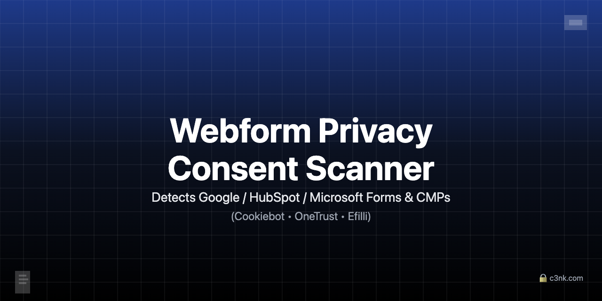

# Webform Privacy Consent Scanner

[](https://github.com/c3nk/webform-privacy-consent-scanner/actions)
[](https://opensource.org/licenses/MIT)
[](https://nodejs.org/)
[](https://www.npmjs.com/package/webform-privacy-consent-scanner)

Advanced web form scanner detecting Google Forms, HubSpot Forms, Microsoft Forms with comprehensive CMP detection including Cookiebot, OneTrust, Efilli, and GDPR compliance auditing.



## 🚀 Quick Start

```bash
# Install
npm install -g webform-privacy-consent-scanner

# Basic scan with CMP detection
webform-scanner --input urls.txt --out results.csv --cmp

# Full scan with dynamic rendering (default wait: 6000ms)
webform-scanner --input urls.txt --dynamic --cmp
```

## 📋 Table of Contents

- [Features](#features)
- [Installation](#installation)
- [Usage](#usage)
- [Supported Platforms](#supported-platforms)
- [Output Formats](#output-formats)
- [Examples](#examples)
- [Contributing](#contributing)
- [License](#license)
- [Security](#security)

## ✨ Features

- 🔍 **Multi-Platform Form Detection**: Google Forms, HubSpot Forms, Microsoft Forms
- 🍪 **Comprehensive CMP Detection**: Cookiebot, OneTrust, Efilli, GTM, Generic GDPR
- 🌐 **Advanced Scanning**: Static HTML + optional Playwright dynamic rendering
- 🔄 **Smart Fallback**: Automatic curl fallback for blocked requests
- 📊 **Multiple Outputs**: CSV, JSON, filtered text reports
- ⚡ **High Performance**: Concurrent scanning with configurable limits
- 🔒 **Privacy Focused**: Respects robots.txt, ethical scanning practices
- 🎯 **CLI First**: Powerful command-line interface with extensive options

## 📦 Installation

### Requirements
- Node.js >= 18
- npm

### Optional Dependencies
- **Playwright** (for dynamic scanning): `npm install -D playwright && npx playwright install`

### Global Installation
```bash
npm install -g webform-privacy-consent-scanner
```

### Local Development
```bash
git clone https://github.com/c3nk/webform-privacy-consent-scanner.git
cd webform-privacy-consent-scanner
npm install

# Optional: Install Playwright for dynamic scanning
npm install -D playwright
npx playwright install
```

## 🎯 Usage

### Basic Scanning
```bash
# Scan URLs with CMP detection
webform-scanner --input urls.txt --cmp

# Output: results_2025-01-15T10-30-00.csv
#         results_2025-01-15T10-30-00.json
```

### Advanced Options
```bash
# Dynamic scanning with custom wait
webform-scanner --input urls.txt --dynamic --wait 10000 --cmp

# High concurrency for large lists
webform-scanner --input large-list.txt --concurrency 16 --timeout 20000

# Custom output location
webform-scanner --input urls.txt --out my-scan-results.csv
```

### Filtering Results
```bash
# Filter Google Forms
node filter.mjs --attr is_google_form --value true

# Filter by CMP vendor
node filter.mjs --attr cmp_vendor --value Cookiebot

# Case-insensitive search
node filter.mjs --attr url --value example.com --ci --contains
```

## 🎪 Supported Platforms

### Form Types
- **Google Forms**: Direct URLs, embedded iframes, form actions
- **HubSpot Forms**: Script detection, API endpoints, inline JavaScript
- **Microsoft Forms**: Response pages, short URLs, Office UI framework

### CMP Platforms
- **Cookiebot**: Popular EU CMP solution
- **OneTrust**: Enterprise-grade consent management
- **Efilli**: Turkish CMP platform
- **Google Tag Manager**: GTM-loaded CMP detection
- **Generic**: Standard GDPR/cookie consent banners

## 📊 Output Formats

### CSV Format
```csv
url,method,status,is_google_form,is_hubspot_form,is_microsoft_form,detected_types,evidence,has_cmp,cmp_vendor,cmp_evidence,note
https://c3nk.com/,static,200,false,false,false,[],,false,,,
```

### JSON Format
```json
{
  "url": "https://c3nk.com/",
  "method": "static",
  "status": 200,
  "is_google_form": false,
  "is_hubspot_form": false,
  "is_microsoft_form": false,
  "detected_types": [],
  "evidence": null,
  "has_cmp": false,
  "cmp_vendor": "",
  "cmp_evidence": "",
  "note": ""
}
```

### Filtered Text Report
```
FILTER REPORT
=============

Input file: results.json
Filter: is_google_form = true
Total results: 1000
Filtered results: 15

RESULTS:
--------
https://c3nk.com/contact
https://example.com/form
...
```

## 🔧 CLI Options

| Option | Description | Default |
|--------|-------------|---------|
| `--input <file>` | Input file with URLs | Required |
| `--out <file>` | Output file path | `results_TIMESTAMP.csv` |
| `--concurrency <n>` | Number of concurrent requests | `8` |
| `--timeout <ms>` | Request timeout | `15000` |
| `--dynamic` | Enable dynamic scanning | `false` |
| `--wait <ms>` | Wait time for dynamic content (default: 6000ms) | `6000` |
| `--cmp` | Enable CMP detection | `false` |

## 📈 Examples

### Live test pages (hosted on c3nk.com)
- HubSpot + Cookiebot (mock signatures): https://www.c3nk.com/examples/forms/hubspot.html?cmp=cookiebot&mode=mock
- Google + OneTrust (mock signatures): https://www.c3nk.com/examples/forms/google.html?cmp=onetrust&mode=mock
- Microsoft + Efilli (mock signatures): https://www.c3nk.com/examples/forms/microsoft.html?cmp=efilli&mode=mock

> **mock mode** embeds only detection signatures (no third‑party requests).
> Use `&mode=live` to actually load vendor scripts for visual checks.

### Local examples (in this repo)
We ship three mock pages under `examples/forms/` with the same signature logic.

### 1. Basic Website Audit
```bash
echo "https://c3nk.com/" > urls.txt
webform-scanner --input urls.txt --cmp
```

### 2. Large Scale Scanning
```bash
webform-scanner --input company-websites.txt --concurrency 20 --cmp --dynamic
```

### 3. GDPR Compliance Audit
```bash
webform-scanner --input eu-websites.txt --cmp --out gdpr-audit.csv
```

### 4. Development Testing
```bash
npm run scan:static  # Uses examples/urls.sample.txt
npm run scan:full    # Dynamic scanning with examples
```

## 🤝 Contributing

We welcome contributions! Please see our [Contributing Guide](CONTRIBUTING.md) for details.

### Development
```bash
npm run start          # Show help
npm run scan:static    # Test static scanning
npm run scan:full      # Test dynamic scanning
```

## 📄 License

This project is licensed under the MIT License - see the [LICENSE](LICENSE) file for details.

## 🔒 Security

Please see our [Security Policy](SECURITY.md) for responsible disclosure practices.

### Responsible Use
- Only scan websites you own or have permission to test
- Respect robots.txt and website terms of service
- Use for legitimate privacy compliance auditing only

## 🗺️ Roadmap

- [ ] Additional CMP platform support
- [ ] Advanced filtering options
- [ ] Web interface
- [ ] API endpoints
- [ ] Docker containerization
- [ ] Integration with popular CI/CD platforms

## 📞 Support

- 📧 Email: me@c3nk.com
- 🐛 Issues: [GitHub Issues](https://github.com/c3nk/webform-privacy-consent-scanner/issues)
- 📖 Documentation: [User Guide](USERGUIDE.md) | [User Guide (TR)](USERGUIDE_TR.md)

---

**Built with ❤️ by [c3nk.com](https://c3nk.com/)**

---

# Webform Privacy Consent Scanner (Türkçe)

[](https://github.com/c3nk/webform-privacy-consent-scanner/actions)
[](https://opensource.org/licenses/MIT)

Google Forms, HubSpot Forms, Microsoft Forms tespit eden gelişmiş web form tarayıcı. Cookiebot, OneTrust, Efilli dahil kapsamlı CMP tespiti ve GDPR uyumluluk denetimi.

## 🚀 Hızlı Başlangıç

```bash
# Kurulum
npm install -g webform-privacy-consent-scanner

# Temel tarama
webform-scanner --input urls.txt --cmp

# Tam tarama (dinamik, varsayılan bekleme: 6000ms)
webform-scanner --input urls.txt --dynamic --cmp
```

## ✨ Özellikler

- 🔍 **Çoklu Platform Form Tespiti**: Google Forms, HubSpot Forms, Microsoft Forms
- 🍪 **Kapsamlı CMP Tespiti**: Cookiebot, OneTrust, Efilli, GTM, Genel GDPR
- 🌐 **Gelişmiş Tarama**: Statik HTML + isteğe bağlı Playwright dinamik render
- 🔄 **Akıllı Fallback**: Engellenen istekler için otomatik curl fallback
- 📊 **Çoklu Çıktı**: CSV, JSON, filtrelenmiş metin raporları
- ⚡ **Yüksek Performans**: Yapılandırılabilir limitlerle eşzamanlı tarama
- 🔒 **Gizlilik Odaklı**: robots.txt'e saygı, etik tarama uygulamaları

## 📦 Kurulum

```bash
# Global kurulum
npm install -g webform-privacy-consent-scanner

# Yerel geliştirme
git clone https://github.com/c3nk/webform-privacy-consent-scanner.git
cd webform-privacy-consent-scanner
npm install
```

## 🎯 Kullanım

### Temel Tarama
```bash
# URL'leri CMP tespiti ile tara
webform-scanner --input urls.txt --cmp
```

### Gelişmiş Seçenekler
```bash
# Dinamik tarama
webform-scanner --input urls.txt --dynamic --wait 10000 --cmp

# Yüksek eşzamanlılık
webform-scanner --input buyuk-liste.txt --concurrency 16 --timeout 20000
```

### Sonuçları Filtreleme
```bash
# Google formlarını filtrele
node filter.mjs --attr is_google_form --value true

# CMP sağlayıcısına göre filtrele
node filter.mjs --attr cmp_vendor --value Cookiebot
```

## 🎪 Desteklenen Platformlar

### Form Türleri
- **Google Forms**: Doğrudan URL'ler, gömülü iframe'ler, form eylemleri
- **HubSpot Forms**: Script tespiti, API uç noktaları, satır içi JavaScript
- **Microsoft Forms**: Yanıt sayfaları, kısa URL'ler, Office UI framework

### CMP Platformları
- **Cookiebot**: Popüler AB CMP çözümü
- **OneTrust**: Kurumsal düzeyde onay yönetimi
- **Efilli**: Türk CMP platformu
- **Google Tag Manager**: GTM üzerinden yüklenen CMP tespiti
- **Genel**: Standart GDPR/çerez onay bannerları

## 🤝 Katkıda Bulunma

Katkılarınızı bekliyoruz! Detaylar için [Katkıda Bulunma Kılavuzu](CONTRIBUTING.md)'na bakın.

## 📄 Lisans

Bu proje MIT Lisansı altında lisanslanmıştır - detaylar için [LICENSE](LICENSE) dosyasına bakın.

## 🔒 Güvenlik

Sorumlu açıklama uygulamaları için [Güvenlik Politikası](SECURITY.md)'mıza bakın.

**Sorumlu Kullanım:**
- Sadece sahip olduğunuz veya test izniniz olan web sitelerini tarayın
- robots.txt'e ve web sitesi kullanım koşullarına saygı gösterin
- Sadece meşru gizlilik uyumluluk denetimi için kullanın

---

**❤️ ile yapıldı: [c3nk.com](https://c3nk.com/)**
